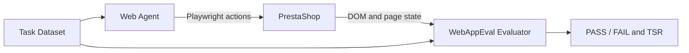

# PrestaShop Web Agent Evaluation

An automated evaluation project for testing web agents on 20 end-to-end
PrestaShop tasks. The project combines a reproducible Docker environment,
Playwright-based agents, and DOM-based WebAppEval matchers.

## Highlights

- 20 tasks covering navigation, search, cart, checkout, authentication, product
  interactions, and account actions.
- Three agent implementations: a deterministic Playwright baseline, a Gemini
  vision agent, and a local Ollama/LLaVA agent.
- Automatic grading with DOM, URL, string, and semantic matchers.
- Reproducible PrestaShop and MariaDB environment through Docker Compose.

The submitted benchmark report records **15/20 tasks passed (75% TSR)**. A
later local baseline run documented in [`REPORT.md`](REPORT.md) records
**12/20 functional passes (60%)** after environment/module differences. Both
figures are retained because they describe different evaluation snapshots.

The complete assignment report is available at
[`docs/report.pdf`](docs/report.pdf).

## Architecture



## Repository Layout

```text
.
├── ai_agent_gemini.py       # Gemini vision agent
├── ai_agent_ollama.py       # Local Ollama/LLaVA agent
├── ai_agent_scaffold.py     # Minimal agent scaffold
├── run_agent.py             # Deterministic Playwright baseline
├── dataset/
│   └── prestashop_tasks.json
├── environments/
│   └── prestashop/
│       └── docker-compose.yml
├── evaluate/                # Evaluation engine and matchers
├── docs/
│   └── report.pdf
├── AGENT_COMPARISON.md
└── REPORT.md
```

## Requirements

- Python 3.11 or newer
- Docker Desktop with Docker Compose
- Git
- Ollama with a multimodal model such as LLaVA (optional)
- Gemini API key (optional)

## Setup

```bash
python3 -m venv venv
source venv/bin/activate
pip install -r requirements.txt
playwright install chromium
```

On Windows, activate the environment with `venv\\Scripts\\activate`.

Start PrestaShop:

```bash
cd environments/prestashop
docker compose up -d
cd ../..
```

Wait until the site is available at <http://localhost:8080>.

## Run the Agents

Deterministic baseline:

```bash
python run_agent.py
```

Gemini vision agent:

```bash
cp .env.example .env
# Add your GEMINI_API_KEY to .env
python ai_agent_gemini.py
```

Local Ollama/LLaVA agent:

```bash
ollama pull llava
python ai_agent_ollama.py
```

## Evaluation Scope

The task set is grouped into four areas:

| Group | Tasks | Examples |
|---|---:|---|
| Visitor actions | `ps_01`-`ps_05` | Newsletter, search, cart, guest checkout |
| Account and forms | `ps_06`-`ps_10` | Registration, login, contact, filters |
| Product interactions | `ps_11`-`ps_15` | Sorting, wishlist, comparison, reviews, coupons |
| Navigation and user actions | `ps_16`-`ps_20` | Category, language, support, gallery, logout |

Tasks are graded from the browser state using the definitions in
`dataset/prestashop_tasks.json`. Some tasks depend on optional PrestaShop
modules or multilingual/currency configuration, so results can vary between
environment snapshots.

## Notes

- Do not commit `.env`; it is ignored by Git.
- Credentials in the Docker Compose and task fixtures are local test-only
  values and must not be reused for real services.
- The PrestaShop OCI image cache is intentionally excluded. Docker Compose
  pulls the required images when the environment starts.

